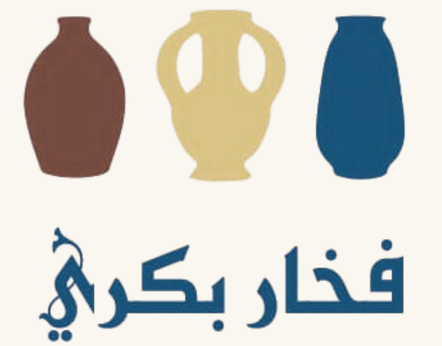
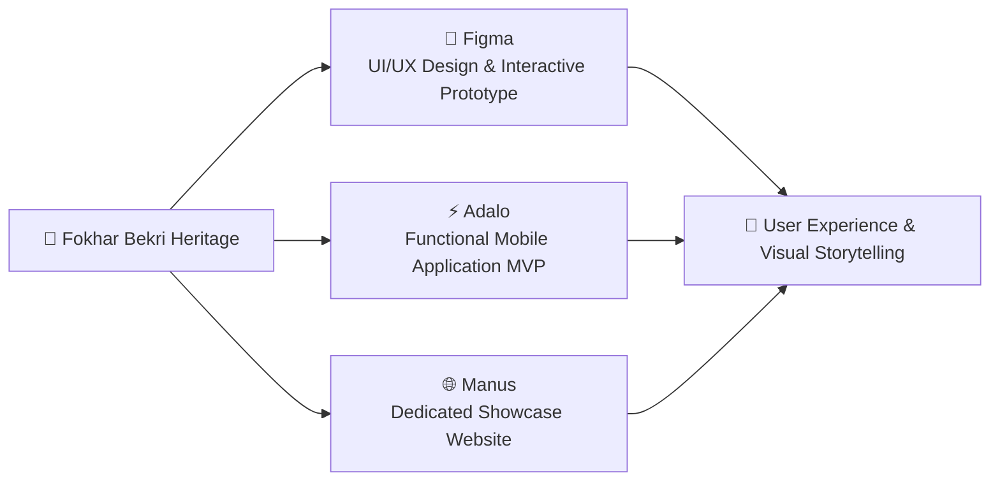
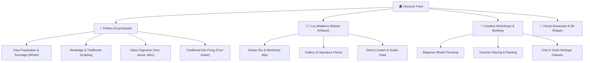

  

<h1 align="center">Fokhar Bekri • فخار بكري</h1>

  <strong>Preserving & Innovating the Ancestral Pottery Heritage of Nabeul, Tunisia through Digital Design</strong>

  
  
  
  
  
  

---

## 🏺 Overview

**Fokhar Bekri (فخار بكري)** is a cultural and digital design initiative dedicated to uncovering, learning, and preserving the timeless pottery craftsmanship of **Nabeul, Tunisia** — the historical ceramic capital of North Africa.

Rooted in thousands of years of Mediterranean, Punic, Roman, and Andalusian heritage, the project leverages **human-centered digital innovation** to reconnect younger generations with traditional craftsmanship, master artisans (*Maâlems*), artisanal modeling and wheel-throwing techniques, workshops, and immersive creative experiences.

> *"Fokhar Bekri bridges the ancestral touch of Tunisian clay with the modern interactivity of digital media — making living heritage accessible, tangible, and inspiring."*

---

## 🌟 Key Objectives

- 🏛️ **Cultural Preservation**: Digitize oral knowledge, ancestral clay preparation methods, natural mineral glazes, and iconic motifs specific to the workshops of Nabeul.
- 👨‍🎨 **Artisan Empowerment**: Provide a digital platform spotlighting master artisans (*Maâlems*), their family workshops, and their artisanal philosophy.
- 📱 **Generational Engagement**: Design intuitive, beautiful mobile and web interfaces tailored to youths and creative communities who crave hands-on, authentic cultural experiences.
- 🎨 **Creative Workshops & Tourism**: Facilitate discovery, reservations, and participation in physical pottery-making and glazing masterclasses in Nabeul.

---

## 🛠️ Multi-Tool Digital Ecosystem

To bring **Fokhar Bekri** to life across every touchpoint, the project combines specialized design, no-code, and web technologies:

### 1. 🎨 Figma — Comprehensive UI/UX & Interactive Prototype
- Designed the end-to-end user experience and high-fidelity prototype of the mobile application.
- **Color Palette & Visual Tokens**:
  - `Vert Nabeul` (*Deep Forest Green* `#0A261A`): Represents the traditional glazed ceramics of the Cap Bon peninsula.
  - `Terre Cuite` (*Terracotta Clay* `#B35434`): The natural fired clay of Nabeul's kilns.
  - `Sable Doré` (*Warm Ochre / Sand* `#E3BA7A`): The Mediterranean beaches and dried clay textures.
  - `Bleu Sidi Bou` (*Cobalt Ceramic Blue* `#1A5B8C`): Inspired by hand-painted floral and geometric enamel work.
  - `Émail Blanc` (*Ivory Cream* `#FAF7EE`): Background tone reflecting clean ceramic glaze.
- **Core Screen Flows**:
  - **Onboarding & Cultural Prelude**: Visual narratives explaining the historical lineage of Nabeul pottery.
  - **Technique Encyclopedia**: Step-by-step guides to *Tournage* (wheel throwing), *Modelage* (hand modeling), *Émaillage* (glazing), and *Cuisson* (wood and gas kiln firing).
  - **Artisan Showcase (*Les Maâlems*)**: Profiles, philosophies, workshop locations, and gallery of signatures.
  - **Workshop Booking & Studio Discovery**: Interactive calendar to book pottery sessions in artisan studios.
  - **Virtual Studio & 3D Interactive Viewer**: Previewing traditional pottery shapes (*Goulla, Chabya, Zir, Mhabba*).
- 🔗 **Interactive Prototype**: [Launch in Figma Viewer](https://www.figma.com/proto/PHwiwpMU1Mo3oWokECiFkm/Untitled?node-id=214-3494&p=f&t=e415MblWQvNLYqWn-0&scaling=min-zoom&content-scaling=fixed&page-id=0%3A1&starting-point-node-id=214%3A3494&show-proto-sidebar=1)

---

### 2. ⚡ Adalo — Functional Mobile Application MVP
- Developed the functional foundation of the mobile application to validate core interactions with real test users.
- Implemented responsive mobile layouts, real-time database models for pottery catalog items, workshop schedules, and user bookmarks.
- Tested user navigation, feedback loops, and interactive artisan directories.

---

### 3. 🌐 Manus — Showcase & Cultural Experience Website
- Built a dedicated web presence detailing the Fokhar Bekri story, cultural mission, and visual brand identity.
- Communicates the educational and heritage value to educators, cultural institutions, tourists, and design communities.

---

## 🎨 Visual Identity & The Logo

The emblem of **Fokhar Bekri** captures the essence of Tunisian ceramic history:

  

1. **Three Traditional Silhouettes**:
   - **The Terra Cotta Jarre (*Goulla*)**: Used ancestrally for natural water cooling and olive oil preservation.
   - **The Two-Handled Amphora (*Chabya*)**: Echoes Mediterranean antiquity and classical storage vessels.
   - **The Cobalt Glazed Vase**: Celebrates the vibrant enamel colors introduced through Andalusian craftsmanship in Nabeul.
2. **Authentic Arabic Calligraphy**:
   - Lettered with classical fluid lines and contemporary geometric balance, proudly pronouncing **فخار بكري** (*Fokhar Bekri* — "Pottery of Ancestral Times").

### 📖 Brand Book & Design Guidelines
The comprehensive design manual and visual identity guidelines for **Fokhar Bekri** are available directly in this repository:
- 📄 **[Download / View Brand Book (PDF)](Brand%20book%20fokhar%20bekri.pdf)** (or mirrored at [`docs/Brand_book_fokhar_bekri.pdf`](docs/Brand_book_fokhar_bekri.pdf))
- **Contents**: Full brand guidelines, logo clear space, color systems, typography pairing, iconography, and application mockups.

---

## 📐 Application Architecture & Feature Map

---

## 🌍 Cultural Impact & Future Roadmap

- [x] **Phase 1: Research & UI/UX**: Historical documentation, stakeholder interviews with Nabeul potters, and full Figma interactive prototype.
- [x] **Phase 2: MVP Development**: Functional application prototyping with Adalo and web showcase via Manus.
- [ ] **Phase 3: Augmented Reality (AR) Integration**: Allowing users to project 3D traditional pottery into their living space and inspect historic textures.
- [ ] **Phase 4: Artisan Marketplace & Fair Trade**: Direct community-supported artisan marketplace empowering local workshops without middlemen.
- [ ] **Phase 5: Educational Heritage Partnerships**: Curriculum integration with Tunisian schools and art academies.

---

## 🤝 Authors & Credits

- **Concept, UI/UX Design & Prototyping**: Sasou Moumou (`sasoumoumou-gif`)
- **Cultural Inspiration**: The pottery masters (*Maâlems*) and heritage workshops of Nabeul, Tunisia.
- **Repository**: [https://github.com/sasoumoumou-gif/fokhar-bekri-](https://github.com/sasoumoumou-gif/fokhar-bekri-)
- **Live Showcase**: [https://sasoumoumou-gif.github.io/fokhar-bekri-/](https://sasoumoumou-gif.github.io/fokhar-bekri-/)

---

  Crafted with passion for Tunisian Cultural Heritage 🇹🇳 • 2026

